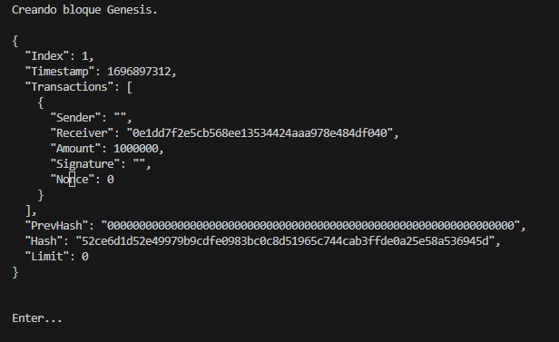
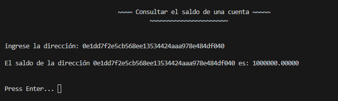
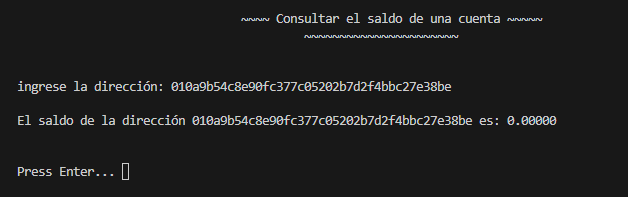
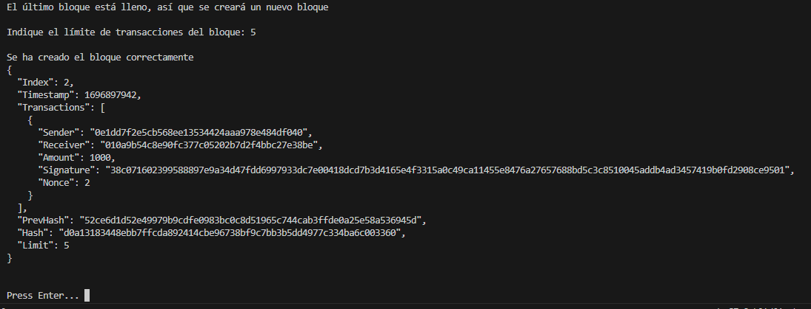
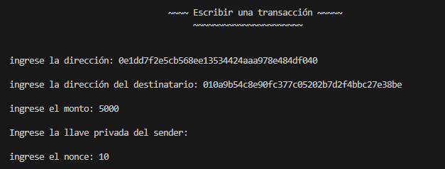
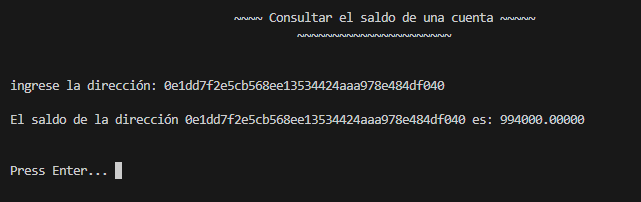
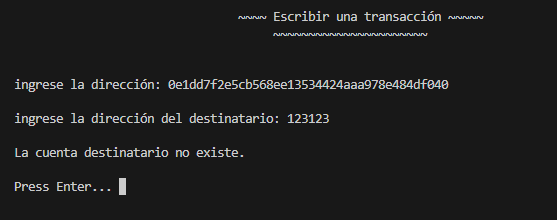
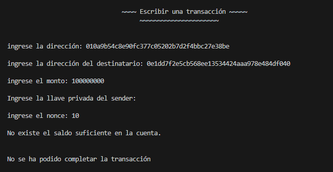
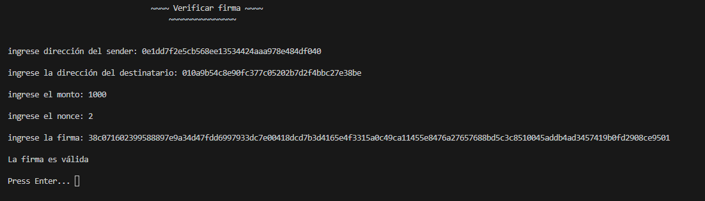
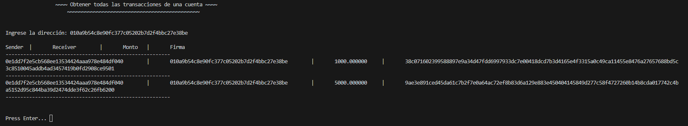

# Blockchain-proyect

## Integrantes: 

- Mirko Babic   -- mirko.babic@mail.udp.cl / mirkobabicvelasquez@gmail.com
- Javier Romo   -- javier.romo@mail.udp.cl / ul.jromoa@gmail.com
- Nicolás Soto  -- nicolas.soto1@mail.udp.cl / nicoandres94@gmail.com

## Descripción

- **Lenguaje:** Go
- **DataBase:** LevelDB
- **Sistema de Cuentas:** Mnemonic ethereum

## Instrucciones de uso

Para utilizar la herramienta se deben seguir los siguientes pasos:

```
git clone https://github.com/grafisec/Blockchain-proyect
```

Se abre la carpeta utilizando visual studio code (sino puede que existan problemas con el limpiar pantalla) e iniciamos el sistema:

```
go run main.go
```

Se desplegará un menú con todas las opciones disponibles:


Para seleccionar una opción solo se debe ingresar el número correspondiente.

## Demostración del funcionamiento 

El sistema cuenta con un total de 6 opciones oficiales, las cuales son:

- **Crear cuenta:** Permite crear una cuenta utilizando MNEMONIC, al utilizar esta opción el sistema mostrará la llave privada, pública y dirección correspondiente, la cual guardará en sus registros para posteriores transacciones.

- **Consultar saldo:** Permite consultar el saldo de una cuenta específica. Se le debe ingresar una dirección válida y el sistema mostará el balance actual de la cuenta.

- **Escribir una transacción:** Permite realizar una transacción y escribirla en un bloque. Se necesitan las direcciones de quién envía y quién recibe, el monto y el nonce de la transacción, además de la llave privada de quién envía para firmar la transacción correctamente. Dicha transacción se escribirá en el último bloque (actualizando su hash por cada transacción que llegue), en caso de que ese bloque esté lleno se creará una nuevo bloque. Al momento de crear el nuevo bloque se pedirá ingresar por consola el número de transacciones máximas que soportará el bloque, esta opción es temporal para demostrar el funcionamiento de esta entrega.

- **Verificar la firma:** Permite verificar la autenticidad de una transacción. Se requieren los datos de la transacción y la firma para verificarla. En caso de que algún dato no coincida la firma será inválida.

- **Ver todas las transacciones:** Permite a partir de una dirección, obtener todas las transacciones hechas y recibidas.

- **Búqueda de bloque:** Permite buscar un bloque utilizando su ID, el sistema retornará un json con toda la información del bloque y transacciones que tiene escritas.

Las opciones 7, 8 y 9 corresponden a funciones hechas para verificar el correcto funcionamiento del sistema, por lo que no forman parte de la entrega.

## Primer inicio (sin los ficheros de leveldb)

Si al momento de iniciar el programa no se encuentran los archivos de leveldb, se creará el bloque génesis con una transacción que será todo el dinero que tendrá la blockchain:



Se observa la estructura de los bloques y su contenido.

La cuenta de pruebas que estaremos utilizando para las primeras transacciones, será una cuenta génesis que tendrá estos valores:

```
Cuenta genesis

Private Key: 5389340a76f6ac7f16dd3accf1ba2fd8cc505451be96601955cf234d4f0915d3

Public Key: 7d6866b740b19acdef6055398dfb2ace996153099471f12f6f1ff19d7856157ddf49cd8bca60f22467dbac63df248e06adbde6246d0c77385b3dd592e3ae31a1

Address: 0e1dd7f2e5cb568ee13534424aaa978e484df040
```

Dicha cuenta también será creada en el momento en que no se encuentren los archivos de leveldb.

### Crear cuenta

Se selecciona la opción número 1:


Se observa la llave privada, pública y la dirección. Por obvias razones, la llave privada debe ser guardada inmediatamente.

La información de la llave pública y dirección quedarán guardadas en el fichero **accounts.db** para realizar las transacciones y trabajar los saldos de cada cuenta.

Específicamente el archivo **accounts.db** guarda la dirección, llave pública y balance de las cuentas. 


### Consultar el saldo de una cuenta

Como se mencionó anteriormente, esta opción permite saber el saldo de una cuenta proporcionando una dirección. 

Se hace la prueba con la cuenta génesis:



Como era de esperar, tiene el saldo que está escrito en el bloque génesis.

Si se intenta con la cuenta creada previamente:



Por obvias razones, el saldo de la nueva cuenta es 0.

En caso de que la cuenta no exista, el programa comunicará el error.

Esta opción se utilizará más adelante para comprobar los resultados de las transacciones.


### Escribir una transacción


Es necesario crear un nuevo bloque. Como se mencionó anteriormente, en esta sección se necesita ingresar el límite de bloques manualmente, para evidenciar que se puede manipular el límite de los bloques. Cabe destacar que la llave privada no se ve porque el imput ha sido escondido.

Se ingresa el valor de 5.



Finalmente, retorna el bloque con la transacción escrita en él para evidenciar el funcionamiento. Se observa el correcto limite y el hash previo, que corresponde al del bloque anterior.

Vamos a realizar otra transacción:



En el valor del bloque se tiene:


Se observan las 2 transacciones hechas con sus respectivos datos.

Algo **importante** a destacar, se ve como el hash del bloque ha cambiado, esto es porque al ingresar nuevas transacciones se recalcula el hash del bloque tomando en consideración las nuevas transacciones que entran en él. Además, cuando llegue la transacción número 5 el bloque se cerrará y tendrá su hash definitivo y no será posible modificarlo.

Comprobemos los balances de las cuentas:



Nuestras transacciones suman 6000, por lo que el balance está correcto.

En la nueva cuenta se tiene:


Como era de esperar, el saldo es de 6000.

#### Casos

- No se pueden ingresar direcciones que no existan:




Por lo tanto, no es posible enviar información a cuentas que no existen.

- Por obvias razones los montos enviados no pueden ser negativos y tampoco puedes enviar más dinero del que tienes:




- El nonce utilizado siempre tiene que ser uno de mayor valor que cualquier otro nonce utilizado en las transacciones anteriores:


En este caso, el último nonce utilizado había sido 10.


### Verificar la firma de una transacción.

Se debe ingresar toda la información de la transacción, como se muestra a continuación:



En este caso, toda la información ingresada corresponde a la original.

Si se cambia algún valor:


Se observa que no es válida, pues se ha modificado el monto. Obviamente eso pasaría si se modifica cualquier valor.

Para validar una firma se necesita la llave pública, en este caso el sistema la busca en el fichero accounts.db, por eso no es necesario pasarle dicha llave.

Esta sección solo tiene la validación para el sender, el resto no tiene para poder modificar los valores y así obtener verificaciones de firmas inválidas.


### Ver todas las transacciones de una dirección

Se debe ingresar la dirección:



Se observan las 2 transacciones que ha recibido esa cuenta, acá también aparecerán las transacciones que ha hecho, no solo las recibidas.

Si se ingresa la cuenta génesis:


Se tienen todas las transacciones que ha hecho y recibido.


### búsqueda de bloque específico usando ID.

Se proporciona el ID 2:


De esta forma, nos muestra todo el bloque con su información y las transacciones escritas en él.

**Con esto se concluye la demostración del funcionamiento.**


## **Librerias utilizadas**:

### main.go
- "Blockchain-proyect/logic"
- "fmt"
- "time"
- "github.com/syndtr/goleveldb/leveldb"

### accounts.go

- "encoding/json"
-	"fmt"
-	"log"
-	"syscall"
-	"github.com/ethereum/go-ethereum/crypto"
-	"github.com/syndtr/goleveldb/leveldb"
-	"github.com/tyler-smith/go-bip39"
-	"golang.org/x/crypto/ssh/terminal"

### Blocks.go

-	"fmt"
-	"time"
- "github.com/syndtr/goleveldb/leveldb"

### Calculate_hash.go

- "crypto/sha256"
-	"encoding/hex"
-	"fmt"

### CTRLc.go

- "fmt"
-	"os"
-	"os/signal"
-"syscall"

### leveldb_logic.go

- "encoding/json"
- "fmt"
- "strconv"
- "github.com/syndtr/goleveldb/leveldb"

### pretty.go

- "encoding/json"
- "fmt"

### Transaction.go

- "crypto/sha256"
-	"encoding/hex"
-	"encoding/json"
-	"fmt"
-	"log"
- "github.com/ethereum/go-ethereum/crypto"
-	"github.com/syndtr/goleveldb/leveldb"
-	"github.com/syndtr/goleveldb/leveldb/util"


